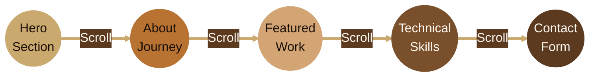

<div align="center">


<br>


[](https://git.io/typing-svg)

<br>


<p>
  
  
  
  
  
</p>

<p>
  
  
  
  
</p>

<br>


<br><br>


## The Revolution in Portfolio Design

```
    ⭐  99% of portfolios look the same
    
    ⭐  This one is built different
    
    ⭐  Premium. Animated. Unforgettable.
```

<br>


### What Makes It Premium

<table>
<tr>
<td align="center" width="50%">

**Standard Templates**


</td>
<td align="center" width="50%">

**This Template**


</td>
</tr>
</table>

<br>


<br><br>


## See It In Action

<br>


<br>

**Every pixel crafted. Every animation perfected. Every detail matters.**

<br>


<br><br>


<br><br>


## Premium Features

<br>

<table>
<tr>
<td align="center" width="25%">


**WebGL Magic**

Three.js shader backgrounds
Rainbow light effects


</td>
<td align="center" width="25%">


**Smooth Scroll**

Momentum-based engine
Buttery 60fps experience


</td>
<td align="center" width="25%">


**Glow Effects**

Rotating border animations
Custom cursor trails


</td>
<td align="center" width="25%">


**Optimized**

Code splitting
Lazy loading


</td>
</tr>
</table>

<br>


<br><br>


## Five Stunning Sections

<br>



<br>

<table>
<tr>
<td align="center" width="20%">

**01 • HERO**

Rainbow shader effects
Animated monogram
Parallax magic

</td>
<td align="center" width="20%">

**02 • ABOUT**

Journey timeline
Dot shader background
Live statistics

</td>
<td align="center" width="20%">

**03 • WORK**

6 Glowing cards
Rotating borders
Project showcase

</td>
<td align="center" width="20%">

**04 • SKILLS**

Hover-to-switch tabs
Animated skill bars
Category system

</td>
<td align="center" width="20%">

**05 • CONTACT**

Squircle inputs
Premium placeholders
Leather background

</td>
</tr>
</table>

<br>


<br><br>


## Built With Excellence

<br>

### Core Technologies


<br>

### Animation & Performance


<br>

### Design Features

<table>
<tr>
<td align="center" width="50%">


</td>
<td align="center" width="50%">


</td>
</tr>
</table>

<br>


<br><br>


## Get Started in 3 Minutes

<br>

<table align="center" width="80%">
<tr>
<td>

<pre>
╔══════════════════════════════════════════════════════════════════╗
║                                                                  ║
║   ┌──────────────────────────────────────────────────────────┐   ║
║   │  TERMINAL                                          ● ● ● │   ║
║   ├──────────────────────────────────────────────────────────┤   ║
║   │                                                          │   ║
║   │  $ git clone [your-repo-url]                             │   ║
║   │                                                          │   ║
║   │  $ cd X-Portfolio                                        │   ║
║   │                                                          │   ║
║   │  $ npm install                                           │   ║
║   │                                                          │   ║
║   │  $ npm run dev                                           │   ║
║   │                                                          │   ║
║   │  ✓ Live at http://localhost:5173                         │   ║
║   │                                                          │   ║
║   └──────────────────────────────────────────────────────────┘   ║
║                                                                  ║
╚══════════════════════════════════════════════════════════════════╝
</pre>

</td>
</tr>
</table>

<br>


<br><br>


<br><br>


## Make It Yours

<br>

<table>
<tr>
<td width="25%" align="center">


**`src/pages/Home.jsx`**

</td>
<td width="25%" align="center">


**`src/pages/Projects.jsx`**

</td>
<td width="25%" align="center">


**`src/pages/Contact.jsx`**

</td>
<td width="25%" align="center">


**`src/index.css`**

</td>
</tr>
</table>

<br>

<p align="center">
  
  
  
</p>

<br>


<br><br>


## Performance Optimized

<br>

<table>
<tr>
<td align="center">


Compositor-only transforms
GPU-accelerated rendering

</td>
<td align="center">


React.lazy + Suspense
Vendor chunk optimization

</td>
<td align="center">


Viewport-gated rendering
Capped pixel ratios

</td>
</tr>
</table>

<br>


<br><br>


## The Craftsman

<br>


<br><br>

<table align="center">
<tr>
<td align="center">


### **Shreyansh Dangar**

#### Full Stack Developer & UI/UX Enthusiast

*Building digital experiences that feel like art*

<br>


<br><br>

<a href="https://github.com/ShreyanshDangar">
  
</a>

</td>
</tr>
</table>

<br>


<br><br>


## Visual Showcase

<br>

<p align="center">
  
</p>

<p align="center"><i>Every section designed to perfection. Every detail matters.</i></p>

<br>

<div align="center">


<table>
<tr>
<td align="center">

<br>
<sub><b>01 • HERO SECTION</b></sub>
<br>
<sub>Rainbow shaders • Animated monogram • Parallax effects</sub>
</td>
</tr>
</table>

<br>


<table>
<tr>
<td align="center" width="50%">

<br>
<sub><b>02 • ABOUT SECTION</b></sub>
<br>
<sub>Journey timeline • Dot shader background</sub>
</td>

<td width="20"></td>

<td align="center" width="50%">

<br>
<sub><b>03 • WORK SECTION</b></sub>
<br>
<sub>Glowing cards • Rotating borders</sub>
</td>
</tr>
</table>

<br>


<table>
<tr>
<td align="center" width="50%">

<br>
<sub><b>04 • SKILLS SECTION</b></sub>
<br>
<sub>Hover-to-switch tabs • Animated bars</sub>
</td>

<td width="20"></td>

<td align="center" width="50%">

<br>
<sub><b>05 • CONTACT SECTION</b></sub>
<br>
<sub>Squircle inputs • Leather background</sub>
</td>
</tr>
</table>

</div>

<br>


<br><br>


<br>

[](https://git.io/typing-svg)

<br><br>

---

<br>

<p align="center">


</p>

<p align="center">
  
</p>

<br>

</div>
